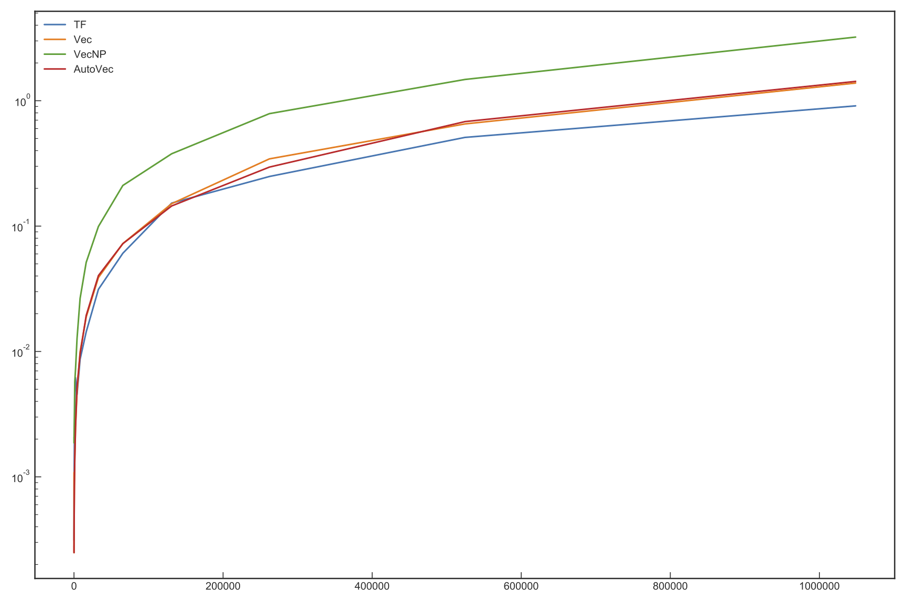

# jax-autovec

How does Jax auto-vectorisation compare against manually-vectorised equivalents?

This is a quick benchmark of a section of batched Kalman filter with a matrix inverse, using auto-graphed and manually-vectorised TensorFlow, manually-vectorised Numpy, manually-vectorised Jax, and auto-vectorised Jax using `vmap`.

  

Here NumPy has a natural disadvantage of not being able to make use of all four CPU cores. For this section of code at least, auto-vectorised Jax is able to replicate the performance of the more fiddly manually-vectorised code.
